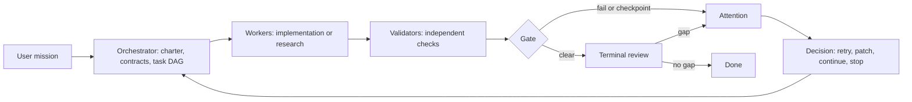
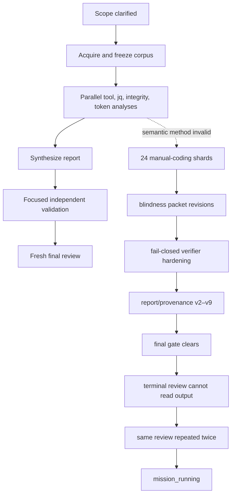
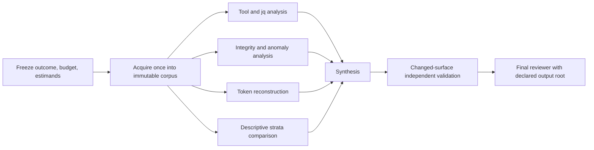

# Zenith Run-Efficiency Research: July 17–19 Production-Log Mission

Status: trace reconstruction complete; proposals are research recommendations, not yet implemented.

Analyzed mission: `mission-001` in project `20260717T130345Z-read-only-all-around-production-log-research-for-agent-builder-p`

Observed interval: 2026-07-17 13:03:45Z through 2026-07-19 15:36:09Z

Current upstream source inspected: commit `feb1d62`

Analysis outputs: [metrics.json](generated/metrics.json), [execution_ledger.csv](generated/execution_ledger.csv), [idle_gaps.csv](generated/idle_gaps.csv)

Evidence locations and method boundary: [SOURCES.md](SOURCES.md)

## Executive finding

The 50.54-hour wall time was not one slow operation. It was a useful core audit wrapped in an expanding assurance system.

The original request legitimately grew from a two-project tool audit into a week-scale, 2,000-plus-session, stratified, request/response and semantic-integrity study. That explains much of the acquisition and analysis work. Zenith then amplified the cost through four mechanisms:

1. it applied an engineering-style atomic-contract and dual-validator topology to exploratory research;
2. an invalid “independent manual coding” method triggered a 24-shard semantic-reliability repair chain;
3. validation fixes accumulated as new versioned task chains and copied evidence packages rather than as bounded deltas;
4. the final reviewer could not see the declared deliverable location, making successful closure impossible.

The run grew from an inferred 24 tasks and 17 contracts to 168 tasks and 44 contracts. It made 142 attempts, 41 attention decisions, and 16 validator attempts against the fail-closed report lineage. The mission evidence tree reached 30,878 files and 42.05 GB of logical data with only two hard-link aliases. Three terminal reviews all returned `done=false`; the runtime remained `mission_running` even though the final v9 gate had cleared.

Unique-only correlation selected 70 of the 145 attempt/reviewer events and classified the other 75 as ambiguous; none were unmatched. Ambiguous events contribute no duration or usage. Zero unmatched events is not evidence that attribution is complete or correct—the ambiguity count is the relevant warning here.

A lean counterfactual keeps the defensible findings and uncertainty boundaries, but treats exploration, statistical estimability, and final acceptance as different things. It would use one immutable corpus, a small set of parallel analysis lanes, early closure of non-estimable population claims, changed-surface validation, and one final reviewer allowed to inspect the declared output root. Its explicitly unmeasured target is 16–24 wall hours for a comparable run (52–68% below actual); only a replay could turn that target into evidence.

## 1. Zenith in five minutes

Zenith is a persistent mission harness. It converts a broad user objective into explicit claims, schedules agents to produce and independently check evidence, pauses when evidence conflicts, and asks a final fresh reviewer whether the user-facing outcome really exists.

The persistent artifacts are the point: another agent can resume without relying on conversational memory.

| Term | Compact meaning | Tiny example |
|---|---|---|
| Mission | The durable charter and boundaries | “Compare two agents over seven days, read-only.” |
| Contract | A testable user-facing promise | “Every headline jq rate reconciles to call-level evidence.” |
| Task | A node of work, validation, or gating | “Build the jq call/result table.” |
| Attempt | One agent execution of one task | First attempt fails because a sidecar is missing. |
| Validation | Independent evidence about a contract | A validator recomputes jq categories from raw events. |
| Gate | A mechanical aggregation of validator verdicts | All active jq assertions pass. |
| Attention | A deliberate pause for orchestration judgment | The sample cannot support a population estimate. |
| Decision | The recorded response to attention | Patch the claim to descriptive-only; do not retry retrieval. |
| Supersession | Replace an obsolete task while keeping history | v2 report task replaces v1 after its method changes. |
| Terminal review | Fresh check against the original request | Confirm that the final report is present and usable. |

For a normal research mission, the contracts should describe defensible conclusions and limitations—not every exploratory question. Discovery can be targetless work until it produces a claim worth accepting.

### Intended loop versus this run

## 2. This run schematically

The original 13:02Z request asked for a broad comparison of tools and results for two Agent Builder projects. The user then explicitly raised the evidence floor: at least a couple thousand sessions, a week of `.ai` traffic, analyst-guided stratification, and wide request/response verification. Those additions are user-requested scope growth.

Zenith encoded the clarified mission as a 2,400-attempt primary corpus plus up to 1,200 rarity-enriched successful sessions, with tool, jq, integrity, comparison, and independently estimated token analyses. The charter required all reproducibility artifacts and the final report to be written under mission evidence.

The subsequent expansion was mostly harness-created assurance work:

| Phase | What happened | Classification |
|---|---|---|
| Clarification and planning | Two contract-review passes, 17 initial assertions, 24 initial tasks | Harness policy applied to legitimate scope |
| Acquisition | Population limitations forced representative-rate claims to become descriptive | Necessary, correct fail-closed adaptation |
| Core analysis | Tool, jq, request/response, token and comparison artifacts produced | Necessary user-facing work |
| Semantic reliability | Generated work had been represented as independent/manual; repair expanded into 24 blinded coding shards | Method defect plus harness amplification |
| Blindness repair | Packet, startup, allowlist and output-root incompatibilities caused repeated revisions | Avoidable orchestration/method overhead |
| Fail-closed repair | Verifiers grew through schema, value, narrative and closed-inventory checks | Partly necessary; repeated full-chain packaging avoidable |
| Report repair | Provenance, runtime identity, stale prerequisites, historical dissent, semantic exactness and broken links produced report v2–v9 | Mixed: real defects, amplified by validation topology |
| Closure | Gate cleared; terminal reviewer was forbidden to inspect the only permitted output tree | Deterministic harness defect |

## 3. What took the time

### Run totals

| Metric | Observed |
|---|---:|
| Wall time | 50.54 h |
| Uniquely matched worker/reviewer active time | 23.99 h |
| Union of uniquely matched active intervals | 21.97 h |
| Non-busy wall time relative to that union | 28.57 h |
| Effective parallelism within the matched subset | 1.09× |
| Configured maximum parallel nodes | 4 |
| Attempts | 142 |
| Attempts requesting attention | 39 |
| Decisions | 41: 30 patch, 5 retry, 6 continue |
| Attempt/reviewer matches | 70 selected; 75 ambiguous; 0 unmatched |
| Task growth | 24 inferred → 168 final (7.0×) |
| Contract growth | 17 inferred → 44 final (2.59×) |
| Supersession operations | 53 |
| Validator handoffs | 11 pass, 23 fail |
| Terminal reviews | 3, all `done=false` |
| Mission evidence | 30,878 files; 42.05 GB logical |
| Codex-reported tokens from uniquely matched sessions | 498.6M total; 483.5M cached input |

Active time is a sum across concurrent sessions; it is not additive with wall time. The token counter is Codex-reported and input already includes cached input. It should not be interpreted as 498.6M newly processed tokens or as billable usage. The 75 ambiguous events are deliberately absent from both totals.

### Active-effort Pareto

| Classified phase | Active effort | Share | Total tokens |
|---|---:|---:|---:|
| Manual semantic reliability | 6.82 h | 26.4% | 112.9M |
| Core analysis | 4.51 h | 17.5% | 114.7M |
| Population and retrieval | 4.40 h | 17.1% | 94.2M |
| Fail-closed analysis repair | 3.67 h | 14.2% | 75.8M |
| Report/provenance repair | 3.06 h | 11.9% | 69.7M |
| Initial planning | 1.79 h | 6.9% | not separately available |
| Other work | 1.18 h | 4.6% | 24.5M |
| Terminal review | 0.35 h | 1.3% | 6.9M |
| Validation | 0.00 h | 0.0% | 0.0M |

These percentages use 25.78 hours: uniquely matched stage time plus the separately observed initial-planning interval. They describe only the attributable subset. In particular, zero attributed validation time means no validation event obtained a unique session match; it does not mean validation work did not occur. The 75 ambiguous rows make a whole-run phase ranking unsupportable from this trace.

### Critical path and idle time

The structural critical path was:

`scope → corpus → core analyses → semantic-reliability repair → fail-closed report → repeated provenance versions → final gate → terminal-review loop`

There are 27 gaps of at least five minutes in the uniquely matched interval union; the two largest were 7.62 h and 5.38 h. The trace includes user interruption, overnight delay, Wi-Fi disruption and external model/usage-limit failures. Therefore the resulting 28.57 non-busy hours are an attribution-sensitive upper bound on scheduling opportunity, not “Zenith idle waste.” The matched subset reached 1.09× effective parallelism; ambiguity prevents treating that as a complete scheduler-utilization measure.

The detailed timestamped ledger is [execution_ledger.csv](generated/execution_ledger.csv). Its phase labels are reproducible heuristics based on task identity and are deliberately not treated as ground truth.

## 4. Why it happened

### A. Exploratory research inherited an engineering acceptance topology

The current orchestrator prompt requires atomic assertions before tasks, adversarial contract review, and at least two sequential contract-review passes for any non-trivial mission. Its default engineering milestone is work → scrutiny validation plus real-surface validation → gate. This is sensible for durable product behavior, but it makes weak epistemic questions look like commitments before source feasibility is known.

In this run, questions such as representative semantic rates were contract-shaped before population eligibility and an independent coding method were established. Later discovery could not simply close the question as non-estimable; it triggered replacement work, validators, gates and assertion versions.

### B. The semantic-reliability method failed before the work did

The first reliability package used generated output as if it were independent manual coding. Correctly rejecting that evidence led to new codebooks, holdouts, blinded packets and 24 review shards. This preserved integrity, but it also created substantial work pursuing semantic rate claims after the population basis had already become descriptive. The unique-only ledger attributes 6.82 active hours to that phase; ambiguous events prevent a defensible whole-phase total.

The missing control was an early question: “Does this claim still change the supported answer enough to justify a statistically independent coding program?”

### C. Blindness was rebuilt through trial and error

Persistent mission memory, sealed-startup rules, allowed packet files and coder output roots were not checked as one system before dispatch. Repeated agents then discovered incompatible assumptions at runtime. A static preflight could have checked self-containment, forbidden-source reachability, output-root writability, identity leakage, and whether two coders were actually independent.

### D. Repair accumulated rather than converged

The report lineage moved through multiple complete packages: runtime identity correction, stale prerequisite correction, new assertion IDs to escape historical dissent, provenance binding, semantic exactness, and link repair. Some defects were real. The costly property was that each fix spawned another work/validator/gate chain and copied large evidence trees.

The mission evidence tree's 42.05 GB across 30,878 files has 30,876 unique inodes. This is not mostly cheap hard-link aliasing. Evidence versions behaved like full packages instead of immutable shared inputs plus small deltas.

### E. Gates aggregate transitive historical validators

The current coordinator walks every transitive predecessor of a gate and includes each validation task whose targets overlap the gate. It then requires all covering validator verdicts to pass. In a versioned repair graph, an old dissent can remain reachable and poison a current gate even when its work has been replaced. The run responded by introducing new report assertion IDs and more validators.

The source comment assumes supersession rewrites dependencies so retired validators are unreachable. This trace demonstrates a topology where that assumption did not protect closure. The correct unit is the current evidence epoch for an assertion, while preserving old dissent as history.

### F. Every gate checkpoint globally interrupts orchestration

The coordinator raises attention even when a gate clears. Attention protocol stops dispatching until every open item has a decision. Checkpoints are valuable at semantic boundaries, but unconditional global pauses make independent subgraphs wait and add orchestration turns that cannot improve the just-cleared evidence.

### G. The final review contract contradicted the mission charter

The mission charter said: write only inside the Zenith mission evidence tree. The terminal-reviewer prompt says its only inspection surface is the normal workspace and explicitly forbids all Zenith project and mission artifacts. The reviewer therefore could not observe the final report by construction.

All three terminal reviews returned the same class of gap. The coordinator treats `done=false` as attention and reaches `Done` only on `done=true`. Repeating the reviewer could not change the answer. A repeated-gap fingerprint should have classified this as a harness configuration conflict after the first occurrence.

### H. Zenith cannot natively explain its own latency

The runtime records attempts, task state and decisions, but it does not bind each attempt to provider session ID, task start/end, queue duration, model/token usage, artifact bytes, or a causal repair family. This analysis had to correlate 142 attempts with external Codex JSONL sessions. Even the exact harness commit that executed the run is absent from the project record.

The inspected current source is behaviorally consistent with the trace, but `feb1d62` is not proven to be the executing commit. Code-level proposals below should therefore be validated against a replay before being treated as historical proof.

## 5. What a lean run would look like

The counterfactual is detailed in [counterfactual_mission.md](counterfactual_mission.md). Its minimum-sufficient DAG is:

Key differences:

- Freeze the quality oracle as defensible conclusions and explicit limitations, not graph completion.
- Perform source and estimability checks before creating acceptance-bearing rate claims.
- Keep one immutable raw/compact corpus; version manifests and derived deltas, not full copies.
- Use parallel targetless discovery lanes; promote only report claims into contracts.
- If representative semantic rates are not estimable, publish descriptive examples and seal the rate claim `NOT ESTIMABLE` instead of launching a coding program by default.
- Validate the changed claim/evidence surface. Reuse unchanged validator results by content hash.
- Run one final review against an explicit, read-only deliverable root with mission history still hidden.

The topology and uniquely attributable subset motivate an unmeasured 16–24 hour wall target under similar external conditions. This is a counterfactual target, not an observed saving or replay result. It should be accepted only if the final conclusions, traceability and uncertainty match the original result under blinded comparison.

## 6. Recommended changes

The branch-ready specifications are expanded in [IMPLEMENTATION_BACKLOG.md](IMPLEMENTATION_BACKLOG.md).

| Priority | Current behavior | Proposed behavior | Before → after | Leverage | Quality risk | Size | Validation experiment |
|---|---|---|---|---|---|---|---|
| P0 | Terminal reviewer sees normal workspace only | Declare read-only `deliverable_roots`; hide process history, not the product artifact | mission-only output → invisible; declared output → reviewable | Closure correctness; prevents infinite loop | Medium: leakage/independence | M | Fixture with output only under mission evidence; clean, missing and tampered cases |
| P0 | Repeated terminal gaps are independent retries | Fingerprint gap + inputs; identical second result raises harness-conflict attention and blocks retry | same review ×3 → review once + diagnose | High on pathological loops | Low | S | Reproduce this run's three-review sequence |
| P0 | Research uses engineering contract defaults | Add research mission policy: discovery tasks first, contracts only for promoted claims | contract-first exploration → feasibility-first claims | Very high | Medium: under-specification | S–M | A/B replay this mission with blinded final quality review |
| P0 | No native duration/session/cost telemetry | Persist session ID, queued/start/end, provider usage, stop reason, parent decision and artifact deltas | external forensic join → native ledger | Enables every later optimization | Low | M | Unit schema tests plus one end-to-end trace reconciliation |
| P0 | Growth is effectively unbounded | Soft budgets for wall time, attempts, task/contract growth and version depth; require explicit value-of-information decision | silent 7× growth → visible budget crossing | High | Medium: premature stopping | M | Shadow-mode alerts on historical traces, no hard stop initially |
| P1 | Gate considers all transitive covering validators | Validate current assertion evidence epoch; retain historical dissent without vetoing replacement evidence | historical veto → active-epoch verdict | High | High: false pass if epoch wrong | L | Property tests over supersession/repair DAGs plus trace replay |
| P1 | Full validation repeats after small repairs | Cache verdict by contract, method and input hashes; invalidate only changed surface | full-chain rerun → delta validation | High | Medium–high | L | Mutation suite proving every relevant change invalidates cache |
| P1 | Blind packets fail at agent runtime | Static packet/startup/output-root/identity lint before dispatch | retry-to-discover → preflight failure | High for this run | Low | M | Encode each observed packet failure as a negative fixture |
| P1 | Non-estimable claims remain active repair targets | First-class `not_estimable` disposition with oracle and preserved descriptive evidence | impossible rate → repair chain; impossible rate → bounded limitation | High | Medium | M | Population-ineligible fixture; ensure no numeric claim can pass |
| P1 | Evidence versions copy full trees | Content-addressed immutable corpus + manifest/delta packages; optionally reflink local materialization | 42 GB versions → shared corpus + small deltas | Storage and read/token cost | Medium: provenance | L | Recreate v2–v9 packages and compare hashes, bytes and validation |
| P1 | Cleared gates always trigger global attention | Semantic checkpoint policy; auto-continue mechanical clears and block only affected subgraph | global stop → scoped continuation | Medium–high | Medium | M–L | Scheduler simulation with independent branches and injected failure |
| P2 | Scheduler optimizes readiness, not mission critical path | Prioritize critical-path nodes and batch independent validators | 1.09× in uniquely matched subset → higher bounded utilization | Medium | Medium | L | Deterministic trace simulation; compare makespan and decisions |
| P2 | Retry/replan relies on prose judgment | Structured failure taxonomy and repair-family loop detector | repeated symptom patches → method-level escalation | Medium | Low–medium | M | Classify historical decisions; measure precision before enforcement |
| P2 | Context capacity failure appears after spawn | Preflight task/context size and choose split or larger-capacity route | failed attempt → planned shard | Low–medium | Low | M | Oversized synthetic task and recorded model-capacity failures |

## 7. Suggested implementation order

1. **Make closure truthful.** Add declared deliverable roots, terminal-gap fingerprinting and exact runtime version recording. These are small, directly reproducible, and do not weaken validation.
2. **Make cost visible.** Add attempt/session/timing/usage/artifact telemetry and emit this ledger natively.
3. **Change research planning policy.** Introduce feasibility-first discovery, a quality oracle, soft growth budgets and first-class `not_estimable` closure. Run this in shadow mode on two research missions.
4. **Prevent known repair classes.** Add blindness-packet lint and structured repair-family/loop detection.
5. **Make validation incremental.** Introduce evidence epochs and hash-keyed reuse behind a feature flag; prove invalidation with adversarial mutation tests before defaulting on.
6. **Reduce data amplification.** Move source corpora to content-addressed immutable storage and emit delta manifests.
7. **Optimize scheduling last.** Once telemetry and correctness semantics are reliable, add critical-path and subgraph-scoped scheduling. Faster scheduling of unnecessary work is a rather expensive form of punctuality.

## Measurement method and limits

`analyze_trace.py` performs mission-evidence-payload-blind analysis over orchestration records and Codex session/event data. It does not open production-log or mission-evidence payload content; it retains bounded Codex session text only for event-to-session correlation. It computes:

- wall interval from project creation through the latest recorded decision;
- active session intervals from `task_started` / `task_complete` events;
- their union and parallel overlap;
- task/contract growth from final state and patch additions;
- attempt, decision and terminal-review counts;
- unique-only match diagnostics, with ambiguous and unmatched events excluded from duration and usage;
- Codex-reported token totals; and
- logical/allocated artifact size and inode counts.

The inferred initial task and contract counts subtract patch additions from final topology; in-place textual changes are not counted. Stage attribution is a task-identity heuristic, not ground truth. Non-busy time includes human and external-system pauses. Zero unmatched events does not prove attribution correctness, and 75 ambiguous events remain deliberately unattributed. The exact executing Zenith commit was not persisted. These limits are reasons to implement telemetry, not invitations to turn estimates into facts.

## Acceptance test for the recommendations

Replay the frozen original brief against current Zenith and a candidate harness with the same data-access limits. Blind the final evaluator to which harness produced each result. A candidate wins only if it:

1. preserves every independently supported conclusion and explicit coverage limitation;
2. introduces no unsupported population, semantic or causal claim;
3. preserves source-to-claim traceability;
4. reaches an honest terminal state;
5. materially reduces wall time, active model effort, attempts, repeated validations, graph growth and artifact bytes.

The first optimization target should be median wall time at equal quality across several research missions, not victory on this single unusually baroque trace.
